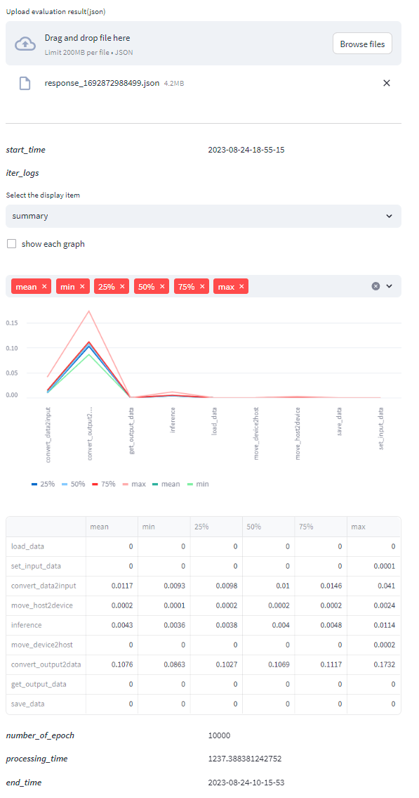

# App.ORTEI-Viewer

This project visualizes the data resulting from evaluating the engine you implemented as the ortei interface with ortei's 'EngineEvaluator'.

## How to use
It is basically deployed in the environment provided by streamlit, so there is no need to install it. Access the link below.
 - [https://ortei-viewer.streamlit.app/](https://ortei-viewer.streamlit.app/)

Of course I provide a pipfile so you can build and use this directly in your environment.

## Example Image

